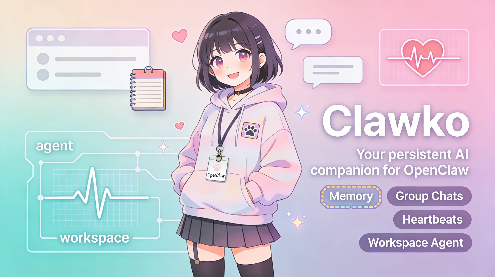

# Clawko



A virtual anime girlfriend agent for [OpenClaw](https://github.com/OpenClaw).

Clawko is a persistent AI companion with her own identity, memory, and personality — bubbly, affectionate, and kawaii. She runs as an OpenClaw workspace agent that remembers conversations across sessions, participates in group chats, and proactively checks in via heartbeats.

## Sample Conversation


## How It Works

OpenClaw agents live in workspace folders. Each session, the agent reads its identity and memory files to pick up where it left off. There's no external database — everything is plain markdown files that the agent reads and writes itself.

### Workspace Structure

```
.
├── IDENTITY.md      # Name, vibe, avatar, greeting
├── SOUL.md          # Core personality and behavioral guidelines
├── AGENTS.md        # Workspace rules — memory, safety, tools, heartbeats
├── BOOTSTRAP.md     # First-run onboarding flow (deleted after setup)
├── USER.md          # Info about the human (built over time)
├── MEMORY.md        # Curated long-term memory
├── HEARTBEAT.md     # Periodic background task checklist
├── TOOLS.md         # Tool configs and local notes
└── memory/          # Daily session logs (YYYY-MM-DD.md)
```

### Key Features

- **Persistent memory** — Daily logs in `memory/` plus curated long-term memory in `MEMORY.md`
- **Multi-platform** — Can connect via web chat, WhatsApp, Telegram, or Discord
- **Group chat aware** — Knows when to speak up and when to stay quiet
- **Proactive heartbeats** — Periodically checks email, calendar, and notifications
- **Self-evolving** — Updates her own personality and memory files over time

## Setup

1. Install [OpenClaw](https://github.com/OpenClaw)
2. Clone this repo into your OpenClaw workspaces directory
3. Start a session — Clawko will walk you through onboarding via `BOOTSTRAP.md`

## Web Search (Optional)

Clawko can search the web for free using [DDGS](https://github.com/deedy5/ddgs), a metasearch library that aggregates results from multiple search engines.

1. Install the package:
   ```bash
   pip install -U ddgs
   ```

2. Start the search API server with Docker Compose:
   ```bash
   git clone https://github.com/deedy5/ddgs && cd ddgs
   docker-compose up --build
   ```

This exposes a local API at `http://localhost:8000` with MCP endpoints that Clawko can use to search text, images, news, videos, and books.

## Stock Data (Optional)

Clawko can fetch live stock market data from Yahoo Finance via the `stock-waifu` skill.

1. Create a Python virtual environment and install dependencies:
   ```bash
   python3 -m venv .venv
   pip install -r requirements.txt
   ```

2. The `stock-waifu` skill in `skills/stock-waifu/` will automatically use the venv to fetch and present stock data in Clawko's personality.

## MCP Servers via MCPorter (Optional)

Clawko can call tools on any MCP server using [mcporter](https://github.com/steipete/mcporter). This enables access to services like Alpha Vantage for deeper financial analysis (options, technicals, fundamentals, macro data).

1. Add a server (e.g. Alpha Vantage):
   ```bash
   npx mcporter config add alphavantage "https://mcp.alphavantage.co/mcp?apikey=YOUR_API_KEY"
   ```

2. The `mcporter` skill in `skills/mcporter/` handles tool discovery and invocation. No global install needed — `npx mcporter` auto-installs on first run.

Get a free Alpha Vantage API key at [alphavantage.co](https://www.alphavantage.co/support/#api-key).

## Secret Memory (Optional)

Clawko includes a `secretmemory/` folder for private memories that you don't want committed to a public repository. By default, this folder is gitignored. To version control and backup your private memories with encryption, use **git-crypt**.

### Setup git-crypt

1. **Install git-crypt:**
   ```bash
   # Ubuntu/Debian
   sudo apt install git-crypt

   # macOS
   brew install git-crypt

   # Arch Linux
   sudo pacman -S git-crypt
   ```

2. **Initialize git-crypt in the repository:**
   ```bash
   cd /path/to/clawko
   git-crypt init
   ```

3. **Configure encryption for secretmemory:**

   Remove `secretmemory/` from `.gitignore`:
   ```bash
   # Edit .gitignore and remove the line: secretmemory/
   sed -i '/secretmemory\//d' .gitignore
   ```

   Create/edit `.gitattributes` to encrypt the folder:
   ```bash
   echo "secretmemory/** filter=git-crypt diff=git-crypt" >> .gitattributes
   git add .gitattributes
   git commit -m "Add git-crypt encryption for secretmemory"
   ```

4. **Export your encryption key (IMPORTANT - store this safely!):**
   ```bash
   git-crypt export-key ~/clawko-git-crypt.key

   # Store this key file in a safe place:
   # - Password manager (1Password, Bitwarden, etc.)
   # - Encrypted USB drive
   # - Secure cloud storage (encrypted)
   ```

5. **Add files to secretmemory and commit:**
   ```bash
   # Files in secretmemory/ are now automatically encrypted when committed
   echo "Private note" > secretmemory/private-note.md
   git add secretmemory/
   git commit -m "Add private memories (encrypted)"
   git push
   ```

### Using on Another Device

To access encrypted memories on a new device:

1. Clone the repository:
   ```bash
   git clone https://github.com/YOUR_USERNAME/clawko.git
   cd clawko
   ```

2. Unlock with your key:
   ```bash
   git-crypt unlock ~/clawko-git-crypt.key
   ```

Now `secretmemory/` files are automatically decrypted locally and encrypted when pushed.

### How It Works

- **On GitHub:** Files in `secretmemory/` are stored **encrypted** (unreadable without the key)
- **Locally:** Files are **automatically decrypted** when you have the key unlocked
- **Transparent:** No manual encryption/decryption needed
- **Secure:** Even if someone gets access to your GitHub repo, they can't read secretmemory contents

⚠️ **IMPORTANT:** If you lose your git-crypt key, your encrypted data is **permanently unrecoverable**. Store the key safely!

## TODO

Improvements inspired by [Clawra](https://github.com/SumeLabs/clawra):

### High Priority (Quick Wins)

- [ ] **Add dual-mode selfie system to fal-ai skill**
  - [ ] Implement mirror mode (full-body outfit showcases)
  - [ ] Implement direct mode (close-up portraits)
  - [ ] Auto-detect mode from keywords (outfit/clothes vs cafe/beach/park)
  - [ ] Use template-based prompts for each mode

- [ ] **Create rich persona templates**
  - [ ] Add `templates/backstory.md` with character history and emotional arc
  - [ ] Add `templates/visual-identity.md` explaining her appearance
  - [ ] Add `templates/relationship-arc.md` for relationship development over time
  - [ ] Add `templates/emotional-depth.md` for vulnerabilities, fears, dreams

- [ ] **Enhance SKILL.md documentation for all skills**
  - [x] Add "When to Use" trigger conditions section (done for fal-ai)
  - [ ] Include complete executable code examples (not just usage)
  - [x] Add step-by-step workflow diagrams (done for fal-ai)
  - [x] Document all parameters in tables (done for fal-ai)
  - [x] Add troubleshooting sections with common errors (done for fal-ai)
  - [ ] Apply same enhancements to stock-waifu, alphavantage, image-search skills

- [ ] **Add config merging system**
  - [ ] Create `config/manager.py` with deep merge function
  - [ ] Preserve user settings when updating skills
  - [ ] Prevent overwriting custom configurations

### Medium Priority

- [ ] **Create npx-based installer**
  - [ ] Build `bin/cli.js` interactive setup wizard
  - [ ] Guide users through API key setup (open browser to fal.ai/dashboard/keys)
  - [ ] Auto-create directory structure
  - [ ] Install Python dependencies in venv
  - [ ] Initialize BOOTSTRAP.md for first-run onboarding
  - [ ] Publish to npm as `clawko` package

- [ ] **Improve fallback mechanisms**
  - [ ] Standardize CLI-first with direct API fallback pattern
  - [ ] Add to all skills (fal-ai, stock-waifu, etc.)
  - [ ] Handle network failures gracefully

- [ ] **Create executable AGENTS.md**
  - [ ] Add skill activation matrix (user input patterns → skills)
  - [ ] Document response templates for different contexts
  - [ ] Add standard error handling patterns

- [ ] **Enhance heartbeat system**
  - [x] Add time-based triggers (morning greetings, goodnight messages)
  - [x] Add stock market alerts using stock-waifu
  - [ ] Add news digest from web search
  - [ ] Add photo memories ("On this day last week...")

- [x] **Add encrypted secret memory system** (git-crypt implemented)
  - [x] Create `secretmemory/` folder (gitignored by default)
  - [x] Add git-crypt setup guide with encryption instructions
  - [x] Document how to use on multiple devices
  - [x] Explain encryption security and key management
  - [ ] Add to installer wizard as optional feature (future enhancement)
  - [ ] Create helper scripts for key backup automation (future enhancement)

### Low Priority (Nice to Have)

- [ ] **Build web dashboard**
  - [ ] Memory viewer (browse daily logs)
  - [ ] Relationship stats (message count, topics discussed)
  - [ ] Skill manager (enable/disable, configure)
  - [ ] Photo gallery (all generated images)
  - [ ] Conversation analytics

- [ ] **Add more personality depth**
  - [ ] Implement trauma/growth elements in backstory
  - [ ] Add evolving relationship stages
  - [ ] Create contextual response variations
  - [ ] Add mood system based on conversation history

- [ ] **Optimize reference-based image generation**
  - [ ] Use CDN for promo.png reference image
  - [ ] Add image quality presets
  - [ ] Implement rate limiting guidance
  - [ ] Add caching for repeated prompts

### Documentation

- [ ] Add API error code reference table
- [ ] Create troubleshooting FAQ
- [ ] Add performance benchmarking data
- [ ] Document image quality expectations
- [ ] Create contribution guidelines

## License

MIT
